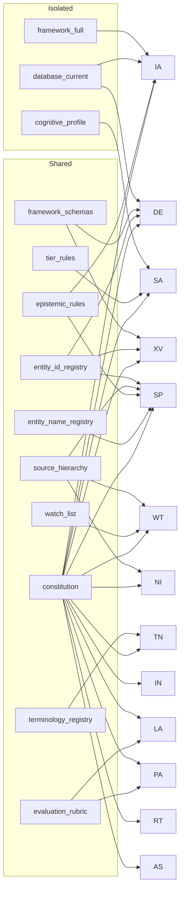

# Baft Design Invariants

This document describes the ITP-specific design constraints in Baft that
instantiate the generic patterns defined in the Loom framework reference.

**Prerequisite reading:** [`loom/docs/DESIGN_INVARIANTS.md`](../../loom/docs/DESIGN_INVARIANTS.md)
— all Loom invariants apply here. This document only covers the Baft-specific
bindings.

---

## Silo Isolation Map

Baft implements the epistemic quarantine pattern (Loom invariant #17) with
these concrete bindings:

| Silo | Isolated? | Permitted workers | Contains |
|------|-----------|-------------------|----------|
| `framework_full` | **Yes** | IA only | Full ITB + ISA analytical framework |
| `database_current` | **Yes** | IA, DE | Current entity state (variables, observations, scenarios) |
| `cognitive_profile` | **Yes** | SA only | Analyst cognitive profile |
| `framework_schemas` | No | DE, XV | Schema definitions (no analytical content) |
| `entity_id_registry` | No | XV, SP, DE | Entity IDs and names only |
| `source_hierarchy` | No | SP, WT, NI | Source tier classification rules |
| `epistemic_rules` | No | SP, IA | Epistemic tag definitions |
| `entity_name_registry` | No | SP | Name/alias/transliteration lookup |
| `terminology_registry` | No | TN only | ITP vocabulary -> neutral term mappings |
| `tier_rules` | No | SA | Task complexity -> tier mapping |
| `watch_list` | No | WT | Priority watch items |
| `constitution` | No | All sighted workers | Procedural/epistemic discipline rules |
| `evaluation_rubric` | No | LA, PA | ROBOTIC-LLM evaluation rubric |

**Hard rule:** `framework_full` and `database_current` must NEVER appear in
the `knowledge_sources` of LA, PA, RT, AS, or SA. This is the concrete
enforcement of Loom invariant #17.

### Silo → Worker Access Graph

The graph shows the information barrier: isolated silos connect only to sighted
workers. Blind workers (TN, LA, PA, RT, AS) receive only `constitution` and
(for LA/PA) `evaluation_rubric`. RT receives constitution only — no rubric.

---

## Blind Audit Tier Table

Baft implements the tiered knowledge deprivation pattern (Loom invariant #19)
with these specific roles:

| Node | Role | Tier | Sees | Blindness |
|------|------|------|------|-----------|
| RT | Red Teamer | frontier (Opus) | constitution only | Fully blind |
| LA | Logic Auditor | standard (Sonnet) | constitution + evaluation_rubric | Blind |
| PA | Perspective Auditor | standard (Sonnet) | constitution + evaluation_rubric | Blind |
| AS | Audit Synthesizer | standard (Sonnet) | constitution + human_decision_log | Partially blind |
| TN | Terminology Neutralizer | local (Haiku) | constitution + terminology_registry | Firewall node |

**RT must not receive the evaluation rubric.** Giving RT structured evaluation
criteria shifts it from adversarial challenge to structured critique — a
different cognitive function. RT's value is unconstrained adversarial pressure.

**AS compares RT challenges against `human_decision_log.yaml`.** If the same
challenge type has been dismissed 3+ times without new counter-evidence, AS
flags it as `BLIND_SPOT_ALERT`. This requires AS to have access to the decision
log but NOT the analytical framework.

---

## TN Specific Rules

TN implements the neutralization firewall pattern (Loom invariant #18):

- TN has exactly two knowledge sources: `constitution` and
  `itp_terminology_registry.yaml`. Nothing else, ever.
- Entity IDs (`V-16`, `Obs-042`, `S-3`) pass through unchanged. They are
  opaque codes, not project terminology.
- The `reverse_map` TN produces is per-document (Loom invariant #20). AS uses
  this exact map to de-neutralize audit findings.

---

## DE Single-Writer Contract

DE implements the single-writer pattern (Loom invariant #28):

- DE is the **exclusive** writer to `framework/data/`. No other worker touches
  these files.
- DE runs as a `ProcessorWorker` — exactly one instance.
- DE enforces a validation chain before any write: schema validation ->
  cross-reference check (XV) -> build verification.
- DE tracks `session_operation_count` per session. When count reaches
  `governance_audit_threshold` (defined in `itp_tier_rules.yaml`, currently 5),
  DE emits `ga_notification` to trigger a governance audit. Bypassing DE skips
  this trigger.

---

## Pipeline-Specific Invariants

### Publication flag (itp_standard pipeline)

IA sets `publication_flag: true` based on content quality assessment, not
analyst intent (Loom invariant #21). If IA detects publication-grade analytical
claims, it flags regardless of whether the analyst said "publish."

The flag triggers escalation from `itp_standard` (Tier 2) to `itp_audit`
(Tier 3).

### RT escalation threshold (itp_audit pipeline)

RT challenge `strength >= 8` on any core claim sets `escalation_required: true`
(Loom invariant #22). AS inherits this and routes to `tier_4_manual` — which
involves an alternate LLM provider (Gemini/GPT) and human review.

**Calibration matters:** Too low = expensive false-positive escalations that
erode trust. Too high = genuine analytical failures reach publication.

### session_id flow (itp_standard pipeline)

`session_id` originates from the analyst, flows via `input_mapping` through
SP -> IA -> XV -> DE (Loom invariant #23). SP does not receive it (stateless
extraction). DE uses it for `session_operation_count` tracking.

If IA filters `session_id` from `integration_spec`, governance audits lose
session granularity.

### Audit pipeline parallelism (itp_audit pipeline)

LA, PA, and RT all depend on TN's output and are assigned `parallel_group:
audit_panel`. Loom's dependency inference (Loom invariant #6) detects they are
independent and runs them concurrently. Do not change their `input_mapping` to
reference each other — this would serialize them and roughly double audit
latency.

---

## SA (Session Advisor) Isolation

SA implements the behavioral monitor isolation pattern (Loom invariant #24):

- SA sees: `cognitive_profile`, `tier_rules`, `constitution`
- SA does NOT see: `framework_full`, `database_current`
- SA monitors: fatigue, priority drift, confirmation bias, tunnel vision,
  tier mismatch, quality gate bypass, emotional escalation
- SA dispatches via scheduler `expand_from: baft.sessions.get_active_sessions`
  — one task per active analyst session

If SA receives framework content, it starts evaluating analytical correctness
instead of behavioral health. "Analyst spent 40 minutes on V-16" gets flagged
as tunnel vision even when V-16 genuinely requires deep analysis.

---

## Constitution Content Rules

The `constitution` silo is injected into 11 of 13 workers, including all blind
auditors. It must contain ONLY:

- Procedural rules (sophisticated actor default, source evaluation standards)
- Epistemic discipline (factional neutrality, anti-bias framing)
- Multilingual source handling rules

It must NEVER contain:

- Thesis statements or variable assessments
- Scenario evaluations or entity analyses
- "Current priorities" or "high-priority findings"

Adding analytical content to the constitution bypasses the entire isolation
architecture through the one silo that every node trusts (Loom invariant #25).

---

## Framework Storage

Baft's analytical knowledge graph lives in `framework/data/` as YAML files in
a git repository. There is no database engine for framework data. DuckDB is
used only for Workshop eval storage and document query backends.

**Why YAML + git:** The framework must be human-readable, git-diffable, and
editable by analysts who are not engineers. The dataset is ~200 entities —
query performance is irrelevant. Migrating to a database engine would lose git
history, remove direct analyst editing, and require DE to implement full CRUD
and migration tooling for zero practical benefit.
